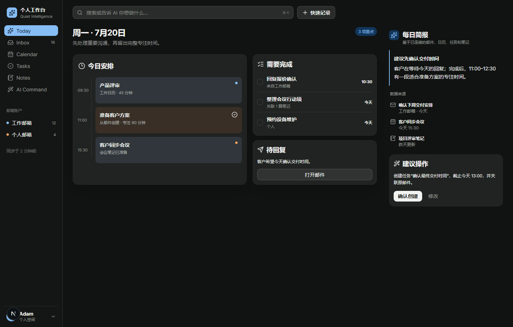

# Kalender

> 一个以 AI 为统一入口，连接邮件、日历、任务和笔记的个人工作台。

Kalender 将个人信息流组织成一条连续工作流：从邮件识别行动项，创建任务并安排时间，关联会议与笔记，最后生成跟进邮件草稿。项目采用本地优先、单用户优先的设计，所有高风险外部操作都应由用户确认。



## 当前状态

项目处于活跃开发阶段。Web MVP 的邮件、日历、任务、笔记、Today、全局搜索、AI 对话和备份基础已经成型；当前重点是跨模块 AI 上下文、可确认的工具操作，以及真实数据下的长期稳定性。

> [!WARNING]
> 当前版本面向本机或可信私网中的个人使用。单用户登录、完整会话保护、CSP 和 CSRF 防护尚未完成，不应直接暴露到公网。

## 已实现能力

- **Today**：聚合当日日程、需推进任务和未读邮件，可直接完成任务。
- **Inbox**：多账户统一收件箱、线程阅读、搜索筛选、已读/星标、移动归档、删除、撰写、回复、转发、附件和 CID 内嵌图片。
- **邮件连接**：通用 IMAP/SMTP 与 Exchange/EWS，支持增量同步、历史回填、失败隔离、指数退避和手动同步。
- **Calendar**：本地日历、周/月视图、冲突检测、任务时间块，以及 CalDAV、ICS 和 Exchange 日历聚合。
- **Tasks**：Today、Inbox、Upcoming、Waiting、Completed、项目和四象限视图，支持来源回链与日历排期。
- **Notes**：Plate 富文本编辑器、自动保存、项目组织、搜索、置顶和笔记转任务。
- **EntityLink**：邮件、事件、任务和笔记之间的双向关联及“相关内容”面板。
- **AI**：可配置 OpenAI-compatible Provider、多模型管理、功能绑定、流式对话、主/备用模型回退、邮件总结、行动项提取和回复草稿。
- **备份**：完整 ZIP 导出、检查、恢复，以及恢复前安全副本。
- **全局操作**：`Ctrl/Cmd + K` 搜索与命令栏、快速记录和统一对象上下文菜单。

## 技术栈

- TypeScript
- Next.js + React
- PGlite（本地嵌入式 PostgreSQL）
- Plate 53 + Radix/shadcn 风格组件
- IMAPFlow、Nodemailer、PostalMime
- CalDAV、ICS、Exchange Web Services
- OpenAI-compatible API

## 快速开始

### 环境要求

- Node.js `>= 24.18.0`
- npm

### 安装与启动

```powershell
git clone https://github.com/Qigang-Wang/Kalender.git
cd Kalender
npm install
npm run dev
```

打开 [http://localhost:3000/today](http://localhost:3000/today)。

首次运行会在项目根目录创建 `.data`。邮件、日历和 AI Provider 都可以在应用设置页中配置。

## 环境变量

复制 `.env.example` 为 `.env`，按需配置：

| 变量 | 用途 |
|---|---|
| `KALENDER_MASTER_KEY` | 可选的 32 字节 Base64 主密钥，用于加密保存的凭据 |
| `KALENDER_DATA_DIR` | 覆盖本地数据目录，默认是项目根目录的 `.data` |
| `KALENDER_SYNC_INTERVAL_MS` | 邮箱后台同步间隔，最小 30 秒，默认 3 分钟 |
| `KALENDER_MAIL_BODY_CACHE_MAX_AGE_DAYS` | 邮件正文缓存有效期，默认 30 天 |
| `KALENDER_MAIL_BODY_CACHE_MAX_MB` | 邮件正文缓存容量上限，默认 128 MB |
| `KALENDER_ALLOWED_DEV_ORIGINS` | 允许访问开发服务器的局域网主机名或 IP |

未设置 `KALENDER_MASTER_KEY` 时，本地开发会生成 `.data/master.key`。数据库和主密钥必须一起备份，否则已保存的凭据无法解密。

## 常用命令

| 命令 | 说明 |
|---|---|
| `npm run dev` | 启动 Next.js 开发服务器 |
| `npm run typecheck` | 检查核心包和 Web 应用类型 |
| `npm run db:migrations:status` | 查看数据库当前版本、迁移历史和待执行版本 |
| `npm test` | 最多并行 4 组运行完整测试；可用 `KALENDER_TEST_CONCURRENCY` 调整并发 |
| `npm run test:serial` | 串行运行完整测试，便于定位相互影响 |
| `npm run build` | 构建核心包和 Web 应用 |
| `npm run build:web` | 只构建 Web 应用 |

## 数据与安全

- 本地数据库、凭据和缓存保存在 `.data`，不会进入 Git。
- 数据库升级使用带校验值的版本化迁移；旧库升级前会在 `.data/automatic-backups` 创建恢复点。
- 邮件、日历和 AI API 凭据使用 AES-256-GCM 加密保存。
- `.backups`、`.logs`、`.next`、`.env`、健康检查输出和构建缓存均被版本控制排除。
- 邮件 HTML 会经过服务端清洗，远程图片默认按需显示。
- 发送邮件、删除数据和修改外部日程等高风险操作必须经过明确确认。
- 不要把 `.data/master.key`、真实 `.env`、备份文件或服务日志提交到仓库。

## 项目结构

```text
apps/web/          Next.js Web 应用与 API
src/mail/          MailProvider 核心接口和通用实现
docs/architecture/ 架构与同步设计
docs/design/       UI 规范、原型和实现截图
docs/roadmap.md    分阶段开发路线图
PROJECT.md         完整产品说明
```

## 接下来

当前优先开发方向：

1. 完成真实双账户连续同步、备份恢复和安全回归；
2. 为 AI 接入受限的跨模块只读上下文和来源卡片；
3. 实现任务、笔记、日程和邮件草稿的操作预览与确认；
4. 补齐提醒、重复任务、重复日程和 CalDAV 双向同步；
5. 完成 Tauri 桌面端、通知和有限离线能力。

更完整的实施状态与规划见：

- [项目说明](PROJECT.md)
- [开发路线图](docs/roadmap.md)
- [AI 集成计划](docs/architecture/ai-integration-plan.md)
- [存储与同步设计](docs/architecture/storage-and-sync.md)
- [UI 设计规范](docs/design/ui-style.md)
