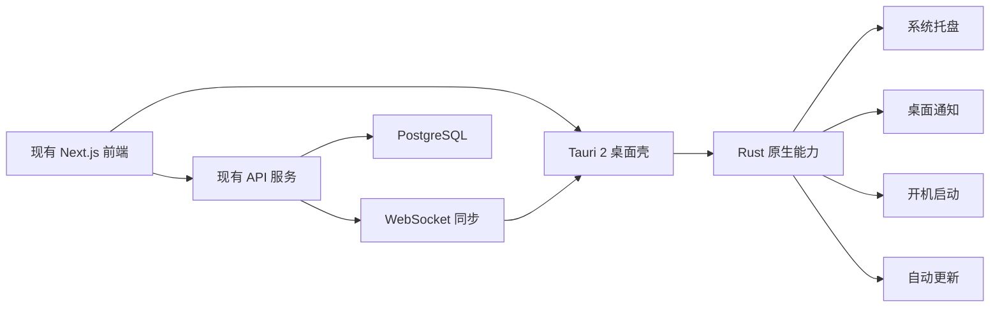

# Tauri 2 桌面客户端方案

## 目标

为 Kalender 增加 Windows、macOS 和 Linux 桌面客户端，同时保留现有 Web 版本，并复用当前的 React/Next.js 前端、服务端 API、数据库和业务逻辑。

桌面客户端重点提供以下能力：

- 系统托盘驻留；
- 原生日程通知；
- 开机自动启动；
- 单实例运行；
- 点击通知打开对应日程；
- 自动更新；
- Windows、macOS 和 Linux 安装包；
- 在较低后台资源占用下持续提供提醒。

## 技术选型

桌面框架选择 Tauri 2：

- 前端继续使用现有 React/Next.js 页面；
- Rust 原生层只负责通知、托盘、启动、更新等桌面能力；
- 数据和业务规则继续由现有服务端 API 提供；
- 实时变更通过 WebSocket 同步；
- 桌面端只保存提醒队列、窗口状态和少量本地偏好，不建立另一套业务数据库。

相较 Electron，Tauri 2 不随应用打包完整 Chromium，而是使用操作系统提供的 WebView。预计资源占用如下：

| 状态 | 预计内存占用 |
|---|---:|
| 仅托盘运行且窗口已销毁 | 10–30 MB |
| 单个简单窗口 | 30–80 MB |
| Kalender 页面空闲 | 80–180 MB |
| 日历、邮件和编辑器正常使用 | 150–350 MB |

以上数据是工程预算，实际结果取决于操作系统、WebView 版本、页面内容和内存统计方式。

## 总体架构



## 应用运行方式

### 第一阶段

第一阶段采用改动最少的服务端模式：

1. Tauri 客户端加载已部署的 Kalender 页面；
2. 登录、邮件、日历、任务、项目和笔记继续由现有 Web 应用提供；
3. Tauri 通过受限权限调用原生通知、托盘和系统启动能力；
4. 用户关闭主窗口时，应用继续在托盘运行；
5. 用户选择“退出”时才终止客户端及本地提醒调度器。

远程页面不应获得未受限制的 Tauri 命令权限。所有原生命令必须使用 Tauri capability、CSP、固定来源校验和最小权限清单进行限制。

### 后续离线能力

如果后续需要离线使用，可以逐步加入：

- 将可静态化的前端资源打包进客户端；
- 缓存近期日程、任务和提醒；
- 增加离线修改队列；
- 网络恢复后执行幂等同步和冲突处理。

第一版不打包完整的 Next.js SSR Node 服务，避免增加内存占用、安装包复杂度和进程管理成本。

## 日程提醒设计

WebSocket 用于实时同步，但不能作为提醒的唯一来源。客户端需要维护本地提醒队列，以处理断网、系统休眠和应用重启。

推荐流程：

1. 客户端启动后读取未来一段时间内的日程及提醒设置；
2. 将提醒时间写入本地持久化队列；
3. WebSocket 接收日程新增、修改和删除事件；
4. 根据变更重新计算对应提醒；
5. Rust 调度器到时调用系统原生通知；
6. 点击通知后唤醒主窗口并打开对应日程；
7. 系统从休眠状态恢复时重新检查已经错过的提醒；
8. 网络恢复后重新获取服务端数据并校准队列；
9. 客户端退出前保存提醒队列和最近同步游标。

需要支持的提醒场景：

- 日程开始前指定分钟数提醒；
- 全天日程按用户设置的时间提醒；
- 重复日程按实例生成提醒；
- 日程修改或删除后取消旧提醒；
- 多设备收到变更后分别更新本地队列；
- 点击通知后定位到正确工作区和日程；
- 勿扰时段和通知权限被关闭时给出状态提示。

## Ubuntu 开发环境

Ubuntu 作为主要开发环境，需要安装 Node.js LTS、Rust stable、Cargo、Tauri CLI 和 Linux WebView 依赖。

```bash
sudo apt update
sudo apt install \
  libwebkit2gtk-4.1-dev \
  build-essential \
  curl \
  wget \
  file \
  libxdo-dev \
  libssl-dev \
  libayatana-appindicator3-dev \
  librsvg2-dev
```

安装 Rust：

```bash
curl --proto '=https' --tlsv1.2 https://sh.rustup.rs -sSf | sh
```

Ubuntu 可以完成：

- 前端和 Rust 业务开发；
- Linux 客户端调试；
- 托盘、通知和窗口生命周期的基础验证；
- 运行单元测试、类型检查和 Web 测试；
- 通过 `cargo-xwin` 交叉编译 Windows NSIS 安装包。

Windows 的 WebView2、通知、托盘、开机启动、安装和更新仍需在真实 Windows 或 Windows 虚拟机中验收。

## 从 Ubuntu 交叉编译 Windows

在必要时，可以通过 `cargo-xwin` 从 Ubuntu 生成 Windows NSIS 安装包：

```bash
sudo apt install nsis lld llvm
rustup target add x86_64-pc-windows-msvc
cargo install --locked cargo-xwin

npm run tauri build -- \
  --runner cargo-xwin \
  --target x86_64-pc-windows-msvc
```

限制如下：

- Ubuntu 可以交叉编译 Windows NSIS `.exe`；
- Windows `.msi` 必须在 Windows 环境中生成；
- 交叉编译的签名配置更复杂；
- 正式发布优先使用 GitHub Actions 的 Windows Runner；
- 发布前必须在 Windows 环境进行功能和安装测试。

## GitHub Actions 原生构建

采用 GitHub Actions 为每个平台使用原生 Runner：

| 平台 | Runner | 输出 |
|---|---|---|
| Windows | `windows-latest` | `.msi`、NSIS `.exe` |
| Linux | `ubuntu-22.04` | `.deb`、`.AppImage` |
| macOS | `macos-latest` | `.app`、`.dmg` |

发布流程：

1. 开发完成后推送代码；
2. 创建版本标签，例如 `v1.0.0`；
3. GitHub Actions 在三个原生 Runner 上分别构建；
4. 自动创建 GitHub Release；
5. 上传安装包、校验文件和自动更新元数据；
6. 已安装客户端通过 Tauri Updater 检查并安装新版本。

CI 至少执行以下检查：

- `npm ci`；
- `npm run typecheck`；
- 项目测试；
- Web 生产构建；
- Rust 格式和静态检查；
- Tauri 平台安装包构建；
- 产物校验和生成；
- 发布版本的签名和更新清单生成。

## 签名与发布安全

测试阶段可以生成未签名安装包。正式发布需要：

- Windows 使用代码签名证书，避免“未知发布者”提示；
- macOS 使用 Apple Developer 证书签名和公证；
- Tauri Updater 的签名私钥仅存放在受保护的 CI Secret 中；
- 所有证书、密码和私钥通过 GitHub Secrets 注入；
- 仓库中只保存公钥和非敏感配置；
- Pull Request 构建不得访问正式发布密钥；
- 只有受保护的版本标签工作流可以签名和发布。

## 建议实施阶段

### P1：桌面壳

- 在当前仓库中加入 Tauri 2 工程；
- 加载现有 Kalender 服务；
- 配置应用标识、图标、窗口尺寸和单实例；
- 实现主窗口显示、隐藏和托盘退出；
- 建立最小权限 capability 和 CSP；
- 验证 Linux 开发环境。

### P2：提醒能力

- 接入系统通知权限；
- 实现本地提醒队列；
- 接入 WebSocket 日程变更事件；
- 处理启动、退出、休眠和恢复；
- 点击通知后打开对应日程；
- 增加开机启动设置；
- 覆盖断网和错过提醒场景。

### P3：跨平台构建

- 增加 GitHub Actions 构建矩阵；
- 生成 Windows MSI 和 NSIS EXE；
- 生成 Linux DEB 和 AppImage；
- 生成 macOS APP 和 DMG；
- 上传测试构建产物；
- 在 Windows、macOS 和 Linux 上完成安装验收。

### P4：正式发布

- 配置 Windows 和 macOS 代码签名；
- 配置 macOS 公证；
- 配置 Tauri Updater；
- 建立版本号、变更日志和回滚流程；
- 完成性能、长期托盘运行和提醒可靠性测试。

### P5：可选离线增强

- 将静态前端资源打包进客户端；
- 增加近期数据缓存；
- 增加离线修改队列；
- 增加冲突检测和恢复界面；
- 评估是否需要本地 SQLite 数据库。

## 第一版边界

第一版包含：

- Windows、macOS 和 Linux 桌面客户端；
- 复用现有在线 Kalender 页面；
- 托盘驻留；
- 开机启动；
- 原生日程通知；
- 点击通知定位日程；
- GitHub Actions 自动生成安装包；
- 自动更新基础能力。

第一版暂不包含：

- 完整离线使用；
- 在桌面客户端内运行完整 Next.js SSR 服务；
- 移动端客户端；
- 为桌面端复制服务端数据库；
- Windows Store、Mac App Store 和 Linux 应用商店发布。

## 最终决策

采用“Ubuntu 日常开发 + Tauri 2 复用现有前端 + 现有服务端继续提供数据 + GitHub Actions 原生构建各平台安装包”的方案。

该方案对现有代码改动较小，可以较快获得托盘、原生通知和自动更新能力，同时保持较低的后台资源占用。Windows MSI 和 NSIS EXE 由 `windows-latest` 构建，Linux 包由 `ubuntu-22.04` 构建，macOS 包由 `macos-latest` 构建。
